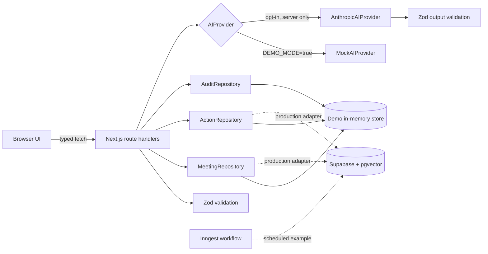
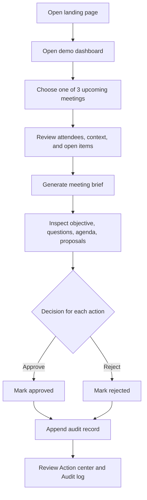

<div align="center">

# ContextFlow

### Walk into every meeting aligned. Walk out with every next step under control.

ContextFlow is a focused, human-in-the-loop meeting copilot that turns relevant context into a structured brief and reviewable follow-up actions—without silently acting on the user's behalf.

<p>
  
  
  
  
</p>

[Run the demo](#three-minute-demo-flow) · [Explore the architecture](#architecture-overview) · [Inspect the safety model](#human-in-the-loop-approval-design) · [Review the code](#what-a-technical-reviewer-should-inspect)

</div>

> [!NOTE]
> The entire core flow works locally with synthetic data and deterministic mock AI. No account, API key, mailbox, calendar, or external service is required.

## At a glance

| | |
| --- | --- |
| **Product focus** | Prepare for one selected meeting and review its proposed follow-ups |
| **Safety boundary** | AI proposes; the user approves or rejects; the MVP never executes |
| **Working surface** | Five responsive pages and six typed API routes |
| **Default data path** | Synthetic seed data → in-memory repositories → deterministic mock provider |
| **Optional AI path** | Server-only Anthropic provider with Zod-validated JSON output |
| **Production direction** | Supabase/PostgreSQL, pgvector retrieval, and durable Inngest workflows |
| **Local start** | `npm install && npm run dev` |

## The 30-second version

Most meeting tools collapse preparation, summarization, and automation into one opaque loop. ContextFlow separates them:

1. **Collect only the context that belongs to the meeting.**
2. **Turn it into a brief whose structure can be validated.**
3. **Treat every follow-up as a proposal, not an instruction.**
4. **Record the human decision before any future execution layer can run.**

That separation is the product idea and the architectural boundary.

## Project status

**Working portfolio MVP.** The complete demo flow runs locally without accounts, credentials, or external services. Local repositories hold synthetic data in process memory, so state resets when the development server restarts.

The project deliberately separates:

- **Implemented:** five responsive pages, six validated API routes, deterministic mock AI, optional server-only Anthropic provider, action approvals/rejections, audit history, tests, and CI.
- **Illustrative production design:** Supabase/PostgreSQL with pgvector, an Inngest scheduled workflow, and a read-only MCP server.
- **Planned:** authentication, durable storage, real calendar/email connectors, semantic retrieval, and action execution adapters.

No production usage, performance metrics, or live third-party integrations are claimed.

## Problem being solved

Meeting preparation is often scattered across the calendar invite, recent email, notes, and unresolved work. Generic summaries can reduce reading time, but they create a second problem when they silently turn suggestions into actions.

ContextFlow tests a narrower product thesis:

1. retrieve only context relevant to a selected meeting;
2. generate a concise, inspectable brief;
3. separate proposed actions from executed actions;
4. require a person to approve or reject every proposal;
5. preserve a simple decision history.

## MVP capabilities

- Shows three seeded upcoming meetings.
- Groups synthetic email, note, calendar, attendee, and action-item context.
- Generates a structured brief with an objective, context summary, open questions, agenda, and proposed actions.
- Uses deterministic mock AI by default and works without credentials.
- Supports an optional Anthropic provider on the server.
- Lets the user approve or reject proposed actions.
- Records each decision with action, status, meeting, actor, and timestamp.
- Handles loading, empty, and error states.
- Provides a responsive, accessible interface with reduced-motion support.

## Three-minute demo flow

1. Run `npm install`, copy `.env.example` to `.env.local`, and run `npm run dev`.
2. Open `http://localhost:3000`.
3. Select **Open demo**.
4. Open **Product weekly: activation** from the dashboard.
5. Review the attendees, synthetic context signals, and carry-over items.
6. Select **Generate meeting brief**.
7. Inspect the objective, context summary, unresolved questions, agenda, and two proposed actions.
8. Approve one action and reject the other.
9. Open **Action center** to see each status.
10. Open **Audit log** to verify the recorded decisions.

All approved actions remain simulated. The demo does not send email, create tasks, or schedule meetings.

## Implemented features

### Product

- Landing page with project positioning and direct demo entry.
- Dashboard with upcoming meetings, pending decisions, recent briefs, and summary counts.
- Meeting detail with focused context and brief generation.
- Action center with pending, approved, and rejected views.
- Audit log with decision metadata.

### Engineering

- Strict TypeScript and shared domain types.
- Interface-driven `MeetingRepository`, `ActionRepository`, `AuditRepository`, and `AIProvider` boundaries.
- Zod validation for action mutations and AI output.
- Typed JSON success/error envelopes.
- Server-only Anthropic SDK access with safe validation failures.
- Deterministic demo repositories backed by one in-memory store.
- Vitest and Testing Library coverage for domain, route, and UI behavior.
- GitHub Actions pipeline for lint, typecheck, tests, and build.

## Planned features

The following are intentionally not implemented:

- user authentication and organization membership;
- persistent Supabase repositories;
- Gmail, Google Calendar, Slack, or task-system OAuth;
- automatic background ingestion;
- production embedding generation and semantic retrieval;
- actual email, task, or scheduling execution;
- multi-tenant observability, rate limiting, or billing;
- a complex agent framework or autonomous tool loop.

## Screenshots

No screenshots are committed. This avoids presenting a fabricated or stale mockup as the working product. The UI is rendered directly from the implementation and can be reviewed through the three-minute flow above.

For a release, capture the real running application at these viewports after completing the verification checklist:

- landing page at 1440×1000;
- dashboard at 1440×1000;
- generated meeting brief at 1440×1000;
- action center at 390×844.

Store verified captures in `docs/screenshots/` and add them here without editing their product state.

## Architecture overview

The MVP uses one Next.js application. Browser components call typed route handlers; handlers validate input and delegate to repository/provider interfaces. Demo implementations share a process-local store. Anthropic is selected only when demo mode is explicitly disabled and a key is available.



### Request path

1. A client page requests a route under `src/app/api`.
2. The handler validates mutable input with Zod.
3. A repository retrieves or updates domain data.
4. Brief generation selects `MockAIProvider` or `AnthropicAIProvider`.
5. AI output is validated before it is saved.
6. An action decision updates the action and appends an audit entry.

## User flow diagram



## Technology stack

| Layer | Technology | Purpose |
| --- | --- | --- |
| Application | Next.js 16 App Router, React 19 | Pages, route handlers, server/client boundaries |
| Language | TypeScript 6, strict mode | Domain contracts and compile-time checks |
| Styling | Tailwind CSS 4 | Responsive design system and UI utilities |
| Validation | Zod 4 | API mutation and AI-output validation |
| AI | Mock provider; optional Anthropic SDK | Credential-free demo and opt-in model calls |
| Test | Vitest, Testing Library, jsdom | Schema, provider, repository, API, and component tests |
| Production examples | Supabase/PostgreSQL, pgvector, Inngest | Persistence, retrieval, scheduled workflows |
| AI development tooling | Claude Code artifacts, MCP SDK | Repeatable engineering instructions and read-only context |
| Delivery | GitHub Actions, Vercel-compatible Next.js build | Automated quality checks and deployment readiness |

## Repository structure

```text
.
├── .claude/
│   ├── agents/code-reviewer.md
│   ├── skills/create-api-route/SKILL.md
│   └── settings.json
├── .github/workflows/ci.yml
├── src/
│   ├── app/
│   │   ├── api/
│   │   ├── actions/
│   │   ├── audit-log/
│   │   ├── dashboard/
│   │   ├── meetings/[id]/
│   │   └── page.tsx
│   ├── components/
│   ├── features/
│   │   ├── actions/
│   │   ├── briefs/
│   │   ├── dashboard/
│   │   └── meetings/
│   ├── lib/
│   │   ├── ai/
│   │   ├── client/
│   │   ├── demo/
│   │   ├── inngest/
│   │   └── validation/
│   ├── test/
│   └── types/
├── supabase/migrations/001_initial_schema.sql
├── tools/contextflow-mcp/
├── AGENTS.md
├── CLAUDE.md
└── README.md
```

## Local setup

### Prerequisites

- Node.js 22.13 or later
- npm 10 or later

### Install and start

```bash
git clone https://github.com/Sonawane07/contextflow-ai-meeting-copilot.git
cd contextflow-ai-meeting-copilot
npm install
```

On macOS/Linux:

```bash
cp .env.example .env.local
```

On PowerShell:

```powershell
Copy-Item .env.example .env.local
```

Start the development server:

```bash
npm run dev
```

Open `http://localhost:3000`.

## Environment variables

| Variable | Required | Use |
| --- | --- | --- |
| `DEMO_MODE` | No | Defaults to demo behavior unless set to `false` |
| `ANTHROPIC_API_KEY` | Anthropic only | Server-side API credential; never exposed to the client |
| `ANTHROPIC_MODEL` | Anthropic only | Model identifier used by the optional provider |
| `NEXT_PUBLIC_SUPABASE_URL` | Planned | Placeholder for a future browser-safe project URL |
| `NEXT_PUBLIC_SUPABASE_ANON_KEY` | Planned | Placeholder for a future browser-safe anonymous key |
| `SUPABASE_SERVICE_ROLE_KEY` | Planned, server only | Future privileged server operations |
| `INNGEST_EVENT_KEY` | Planned | Future event publishing |
| `INNGEST_SIGNING_KEY` | Planned | Future webhook verification |

`.env.example` contains names only. Never commit real values.

## Demo mode instructions

Demo mode is the default:

```dotenv
DEMO_MODE=true
```

It uses:

- exactly three upcoming synthetic meetings;
- synthetic attendee, email, calendar, note, and action-item data;
- `MockAIProvider` for deterministic brief generation;
- process-local repositories for actions and audit entries.

Restarting the server resets all decisions. This is expected MVP behavior.

## Optional Anthropic API setup

Anthropic is opt-in. Put these values in `.env.local`:

```dotenv
DEMO_MODE=false
ANTHROPIC_API_KEY=your_key_here
ANTHROPIC_MODEL=your_supported_model_id
```

Then restart `npm run dev`. The provider:

- is imported and instantiated only on the server;
- requests JSON matching the brief contract;
- treats meeting context as untrusted data;
- validates parsed output with Zod;
- returns a safe error and saves nothing if validation fails.

Do not prefix the API key with `NEXT_PUBLIC_`.

## Supabase production design

`supabase/migrations/001_initial_schema.sql` is an illustrative migration, not an active application dependency. It defines:

- `meetings`;
- `context_items`;
- `meeting_briefs`;
- `proposed_actions`;
- `audit_logs`.

Every table includes `user_id`. The example enables row-level security, adds user-scoped policies, and creates indexes for meeting, action, audit, and retrieval access patterns.

A production implementation would:

1. add Supabase authentication;
2. resolve the current user on the server;
3. implement repository interfaces with Supabase queries;
4. use transactions or a database function for action decision plus audit insertion;
5. restrict privileged keys to server runtimes;
6. test RLS with multiple user identities before deployment.

## pgvector retrieval design

The migration enables `vector` and adds an optional embedding to `context_items`.

The intended retrieval flow is:

1. normalize a selected meeting’s title, attendees, and agenda;
2. create an embedding on the server;
3. filter candidates by authenticated `user_id`, bounded time window, and allowed context type;
4. rank the filtered candidates with cosine distance;
5. apply a similarity threshold and a small top-k limit;
6. pass only the selected snippets to the brief provider;
7. retain source identifiers so every brief input can be inspected.

This design avoids treating a person’s entire history as default prompt context. The embedding dimension and HNSW tuning must match the production embedding model and observed data distribution.

## Inngest production workflow design

`src/lib/inngest/functions/generate-daily-brief.ts` demonstrates a weekday 07:00 scheduled function with a durable step and retries.

It is labeled example-only and is not served in demo mode. Production work would add:

- an authenticated Inngest route;
- a user/time-zone fan-out strategy;
- idempotency per user, meeting, and date;
- rate and concurrency limits around provider calls;
- durable persistence through repository adapters;
- dead-letter handling and provider observability.

## API route table

All responses use either `{ "data": ... }` or `{ "error": { "code", "message", "details?" } }`.

| Method | Route | Behavior | Validation |
| --- | --- | --- | --- |
| `GET` | `/api/meetings` | Lists three seeded upcoming meetings | Typed repository output |
| `GET` | `/api/meetings/[id]` | Returns one meeting and focused context | 404 for unknown ID |
| `POST` | `/api/meetings/[id]/brief` | Generates, validates, and saves a brief; upserts proposals | Zod AI-output schema |
| `GET` | `/api/actions` | Lists actions in newest-first order | Typed repository output |
| `PATCH` | `/api/actions/[id]` | Applies an approved/rejected transition and records audit | Zod decision schema; 404/409 handling |
| `GET` | `/api/audit-logs` | Lists decision history | Typed repository output |

No additional public API routes are implemented.

## Data model summary

| Entity | Important fields | Relationship |
| --- | --- | --- |
| Meeting | title, time, attendees, context, carry-over items | Has zero or one current brief in demo memory |
| Context item | type, title, body, source, occurred time | Belongs to a meeting |
| Meeting brief | objective, context, questions, agenda, provider | Belongs to a meeting and proposes actions |
| Proposed action | type, title, description, status | Belongs to a meeting |
| Audit log | action, status, meeting, actor, timestamp | Appended after a human decision |

## Claude Code development workflow

The repository includes a minimal, inspectable Claude Code setup:

1. `CLAUDE.md` supplies project boundaries and quality commands.
2. `.claude/skills/create-api-route/SKILL.md` provides a repeatable API-route workflow.
3. `.claude/settings.json` runs non-mutating verification at session stop.
4. `.claude/agents/code-reviewer.md` defines a read-only safety-focused review role.
5. `.mcp.json.example` shows how to connect the local read-only MCP server.

The configuration is intentionally small enough for a reviewer to understand without hidden automation.

## `CLAUDE.md` explanation

`CLAUDE.md` records the project purpose, architecture, commands, strict TypeScript expectations, validation rules, AI safety rules, and secret-handling boundaries. It explicitly requires lint, typecheck, tests, and build before a change is considered complete.

## Custom skill explanation

The `create-api-route` skill directs Claude Code to inspect neighboring route patterns, validate inputs with Zod, use typed errors, preserve server-only secrets and the approval boundary, add tests, and update public documentation.

## Hook explanation

`.claude/settings.json` defines a safe `Stop` hook:

```bash
npm run typecheck && npm test
```

It verifies work and does not modify source files. Lint and build remain explicit completion commands because they are slower and easier to inspect when invoked directly.

## Reviewer subagent explanation

`.claude/agents/code-reviewer.md` is a read-only review profile. It checks:

- TypeScript quality;
- API and AI-output validation;
- secret exposure;
- human-approval logic;
- test coverage;
- server/client separation.

It reports findings rather than editing code.

## MCP server explanation

`tools/contextflow-mcp/index.ts` is a small stdio server built with the Model Context Protocol SDK. It exposes three static resources:

- project overview;
- implemented API route list;
- database schema summary.

It has no mutating tools, reads no credentials, and accesses no user data.

Run it:

```bash
npm run mcp:dev
```

Use `.mcp.json.example` as a placeholder-only client configuration and replace its `cwd` with an absolute local path.

## Security and privacy design

- Demo data is synthetic and contains no personal mailbox or calendar data.
- The product retrieves context for one selected meeting, not an unbounded personal corpus.
- Anthropic credentials stay in server-only modules and environment variables.
- All model output is untrusted until it passes the Zod contract.
- Context is labeled untrusted in the Anthropic system instruction to reduce prompt-injection risk.
- Route errors avoid stack traces, raw provider responses, and credentials.
- Production SQL scopes rows by `user_id` and includes example RLS.
- The MCP server is static and read-only.
- No action adapter is present, so approval cannot accidentally send or schedule anything.

Production still requires threat modeling, CSRF/auth controls, rate limits, content retention policies, encryption/key management review, provider data-processing review, audit immutability, and security testing.

## Human-in-the-loop approval design

The domain makes `pending`, `approved`, and `rejected` explicit states. A route accepts only the latter two as decisions. It rejects a second decision with HTTP `409`, preventing silent overwrites. A successful transition appends an audit record with actor and timestamp.

Approval in this MVP means **permission recorded**, not **side effect executed**. A production action runner would consume only approved records, use idempotency keys, show a final payload preview where appropriate, and record execution separately from approval.

## Testing strategy

The suite contains seven test cases across five test files:

1. meeting brief Zod validation, including an invalid unsafe action type;
2. deterministic mock AI generation;
3. both approval and rejection transitions plus audit recording;
4. the meetings API response envelope and seeded count;
5. meeting-card content and accessible navigation.

Run once:

```bash
npm test
```

Watch while developing:

```bash
npm run test:watch
```

Full local verification:

```bash
npm run lint
npm run typecheck
npm test
npm run build
```

## CI workflow

`.github/workflows/ci.yml` runs on pull requests and pushes to `main` with Node.js 24:

1. `npm ci`;
2. `npm run lint`;
3. `npm run typecheck`;
4. `npm test`;
5. `npm run build` with demo mode enabled.

The workflow uses only standard checkout and Node setup actions. It requires no secrets for the demo build.

## Design decisions

### One process-local store

All demo repositories share one store so a generated brief, action decision, and audit record remain coherent across route calls. This keeps the demo functional without disguising local memory as durable storage.

### Provider interface instead of an agent framework

Brief generation is one bounded model call with a strict response contract. A provider interface is enough to swap deterministic mock output for Anthropic without adding tool loops, planners, or hidden autonomy.

### Focused retrieval inputs

Each meeting owns a small set of directly relevant context. This models the desired product boundary and keeps prompt inputs reviewable.

### Approval and execution are different concepts

The MVP records a decision but has no executor. This makes the safety boundary visible in both code and UI.

### Client-side route exercise

Interactive pages call the same APIs a separate client could use. This makes loading and error behavior demonstrable and keeps route contracts testable.

## Tradeoffs

- In-memory state makes setup effortless but resets on restart and is unsuitable for multi-instance deployment.
- A current brief is stored on the meeting rather than versioned; production should retain immutable generations.
- The deterministic mock is excellent for repeatable demos but cannot exercise provider latency or semantic variability.
- Browser-side fetching produces clear loading states but does not optimize initial HTML with server-fetched data.
- A single application simplifies review, while production background work and connectors would need stronger operational boundaries.
- Seed dates are generated relative to server startup to remain upcoming; they are stable for a run rather than globally fixed forever.

## Known limitations

- No authentication, authorization, or durable database adapter.
- No live Gmail, Google Calendar, Slack, Asana, or other third-party connection.
- No actual action execution.
- No cross-process consistency or concurrency control.
- No brief history or action re-open workflow.
- No production telemetry, rate limits, or cost controls.
- The Anthropic path requires a user-supplied supported model identifier and has not been exercised by the credential-free test suite.
- The Supabase, pgvector, and Inngest files are design examples, not live demo dependencies.
- Screenshots are intentionally absent until captured from a verified running deployment.
- This lockfile currently reports 16 high-severity transitive `npm audit` findings, including advisories in the current Next.js dependency tree. npm's proposed forced fix includes breaking downgrades, so it was not applied; upgrade to patched upstream releases when available.

## Production Extension Plan

The safest path from MVP to production is incremental:

1. **Identity and persistence:** add Supabase Auth, server-side session resolution, production repository adapters, transactions, and tested RLS.
2. **Meeting-scoped connectors:** connect calendar metadata first, then allow a user to explicitly select mail/note sources for a meeting.
3. **Retrieval pipeline:** normalize, embed, filter by tenant/time/type, rank, threshold, and preserve citations.
4. **Durable generation:** serve the Inngest function, add idempotency, retry policy, provider timeouts, and generation history.
5. **Approval hardening:** add payload previews, role-aware approval, immutable decision records, and re-authentication for sensitive actions.
6. **Execution adapters:** introduce one adapter at a time; execute only approved actions with idempotency and separate execution audit events.
7. **Operations:** add structured logs, traces, alerting, cost budgets, abuse controls, deletion workflows, and incident runbooks.

Every phase keeps the demo boundary honest: a feature moves from “planned” to “implemented” only after it is integrated, tested, and documented.

## Production roadmap

| Phase | Outcome | Exit criterion |
| --- | --- | --- |
| 1 | Authenticated persistent workspace | Multi-user RLS tests pass and state survives deploys |
| 2 | Meeting-scoped calendar context | User can connect, select, revoke, and delete data |
| 3 | Citation-preserving retrieval | Every brief claim maps to an inspectable source |
| 4 | Durable scheduled briefs | Idempotent jobs are observable and retry safely |
| 5 | One controlled execution adapter | Approval, execution, and failure are separately audited |
| 6 | Production hardening | Threat model, rate limits, retention, and runbooks are complete |

## What a Technical Reviewer Should Inspect

Start with these files:

1. `src/lib/ai/provider.ts` and both provider implementations for the model boundary.
2. `src/lib/validation/brief.ts` for the structured AI contract.
3. `src/lib/demo/repositories.ts` for interface-driven state transitions.
4. `src/app/api/actions/[id]/route.ts` for approval and audit behavior.
5. `src/features/meetings/meeting-detail-client.tsx` for the complete user flow.
6. `src/features/actions/repositories.test.ts` for decision transition coverage.
7. `supabase/migrations/001_initial_schema.sql` for the production data and RLS sketch.
8. `CLAUDE.md`, `.claude/`, and `tools/contextflow-mcp/` for the AI development workflow.

Then run the four verification commands and complete the three-minute demo.

## What I learned

- A useful AI demo benefits more from a narrow, inspectable context boundary than from broad ingestion.
- Structured output validation belongs directly at the provider boundary.
- Approval state, audit state, and execution state should be modeled separately from the start.
- Deterministic model substitutes make product behavior testable without hiding which path is real.
- AI coding configuration is strongest when it is concise, repository-specific, and backed by executable quality checks.

## Contributing

Small, documented changes are welcome:

1. create a focused branch;
2. preserve the implemented/planned distinction;
3. add or update meaningful tests;
4. run lint, typecheck, tests, and build;
5. update this README when behavior or public contracts change;
6. never include credentials or real personal meeting data.

See `AGENTS.md` and `CLAUDE.md` for repository-specific development rules.

## License

This project is available under the [MIT License](LICENSE).
