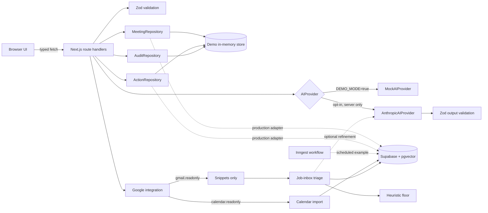
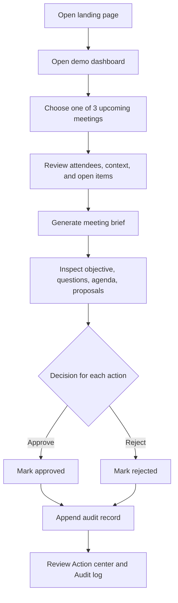

<div align="center">

# ContextFlow

### Walk into every meeting aligned. Walk out with every next step under control.

ContextFlow is a focused, human-in-the-loop meeting copilot that turns relevant context into a structured brief and reviewable follow-up actions—without silently acting on the user's behalf.

<p>
  
  
  
  
</p>

**[▶ Open the live demo](https://contextflow-ai-meeting-copilot-jkkpipfqw.vercel.app)**

[Run it locally](#three-minute-demo-flow) · [Explore the architecture](#architecture-overview) · [Inspect the safety model](#human-in-the-loop-approval-design) · [Review the code](#what-a-technical-reviewer-should-inspect)

</div>

> [!NOTE]
> The live demo and the local default both run on synthetic data with deterministic mock AI. No account, API key, mailbox, calendar, or external service is required — open the link and click through the whole flow.

## At a glance

| | |
| --- | --- |
| **Product focus** | Prepare for one selected meeting and review its proposed follow-ups |
| **Safety boundary** | AI proposes; the user approves or rejects; the MVP never executes |
| **Working surface** | Six responsive pages and seventeen typed API routes |
| **Default data path** | Synthetic seed data → in-memory repositories → deterministic mock provider |
| **Persistent path** | Supabase Auth → RLS-scoped PostgreSQL repositories behind the same interfaces |
| **Optional AI path** | Server-only Anthropic provider with Zod-validated JSON output |
| **Production direction** | pgvector semantic retrieval with citation-preserving context |
| **Live demo** | [contextflow-ai-meeting-copilot-jkkpipfqw.vercel.app](https://contextflow-ai-meeting-copilot-jkkpipfqw.vercel.app) |
| **Local start** | `npm install && npm run dev` |

## The 30-second version

Most meeting tools collapse preparation, summarization, and automation into one opaque loop. ContextFlow separates them:

1. **Collect only the context that belongs to the meeting.**
2. **Turn it into a brief whose structure can be validated.**
3. **Treat every follow-up as a proposal, not an instruction.**
4. **Record the human decision before any future execution layer can run.**

That separation is the product idea and the architectural boundary.

## Project status

**Working portfolio MVP with two runtime modes.** The complete demo flow runs locally without accounts, credentials, or external services; in-memory repositories hold synthetic data, so state resets when the development server restarts.

Setting `DEMO_MODE=false` with a configured Supabase project switches the same routes onto authenticated, row-level-secured PostgreSQL repositories. A partially configured deployment stays in demo mode rather than failing at request time.

The project deliberately separates:

- **Implemented:** six responsive pages, seventeen validated API routes, read-only Google Calendar import, read-only Gmail context and job-application inbox triage, email/password authentication, persistent Supabase repositories behind the same interfaces as the demo ones, deterministic mock AI, optional server-only Anthropic provider, action approvals/rejections, audit history, tests, and CI.
- **Illustrative production design:** pgvector semantic retrieval and a read-only MCP server.
- **Planned:** Slack and task-system connectors, semantic retrieval, and action execution adapters.

No production usage, performance metrics, or live third-party integrations are claimed.

## Problem being solved

Meeting preparation is often scattered across the calendar invite, recent email, notes, and unresolved work. Generic summaries can reduce reading time, but they create a second problem when they silently turn suggestions into actions.

ContextFlow tests a narrower product thesis:

1. retrieve only context relevant to a selected meeting;
2. generate a concise, inspectable brief;
3. separate proposed actions from executed actions;
4. require a person to approve or reject every proposal;
5. preserve a simple decision history.

## MVP capabilities

- Shows three seeded upcoming meetings.
- Groups synthetic email, note, calendar, attendee, and action-item context.
- Generates a structured brief with an objective, context summary, open questions, agenda, and proposed actions.
- Uses deterministic mock AI by default and works without credentials.
- Supports an optional Anthropic provider on the server.
- Lets the user approve or reject proposed actions.
- Records each decision with action, status, meeting, actor, and timestamp.
- Surfaces job-search email still waiting on a reply, classified and dismissible by hand (persistent mode with Gmail connected).
- Handles loading, empty, and error states.
- Provides a responsive, accessible interface with reduced-motion support.

## Three-minute demo flow

1. Run `npm install`, copy `.env.example` to `.env.local`, and run `npm run dev`.
2. Open `http://localhost:3000`.
3. Select **Open demo**.
4. Open **Product weekly: activation** from the dashboard.
5. Review the attendees, synthetic context signals, and carry-over items.
6. Select **Generate meeting brief**.
7. Inspect the objective, context summary, unresolved questions, agenda, and two proposed actions.
8. Approve one action and reject the other.
9. Open **Action center** to see each status.
10. Open **Audit log** to verify the recorded decisions.

All approved actions remain simulated. The demo does not send email, create tasks, or schedule meetings.

## Implemented features

### Product

- Landing page with project positioning and direct demo entry.
- Email/password sign-in and sign-up, with each account scoped to its own meetings, briefs, actions, and audit history.
- Dashboard with upcoming meetings, pending decisions, recent briefs, and summary counts.
- Meeting detail with focused context and brief generation.
- Action center with pending, approved, and rejected views.
- Audit log with decision metadata.
- Read-only Google Calendar connection: import upcoming events as meetings, re-sync on demand, disconnect and revoke.
- Job-application inbox on the dashboard: scans recent job-search mail, sorts what still owes a reply to the top, explains every classification in one line, and lets the user mark an item handled.

### Engineering

- Strict TypeScript and shared domain types.
- Interface-driven `MeetingRepository`, `ActionRepository`, `AuditRepository`, and `AIProvider` boundaries, with in-memory and Supabase implementations of each repository.
- One request-scoped factory (`getRequestContext`) that resolves identity and repositories, so no route handler imports a concrete implementation.
- Supabase Auth with server-side session verification, session refresh in `src/proxy.ts`, and row-level security policies scoping every table to `auth.uid()`.
- Compare-and-set approval writes, so two concurrent decisions cannot both succeed.
- Google OAuth with PKCE, CSRF state in httpOnly cookies, and AES-256-GCM encryption of access and refresh tokens before they reach the database.
- A heuristic classification floor under every model call, so inbox triage degrades to something useful rather than nothing when Anthropic is unconfigured or failing.
- Zod validation for credentials, action mutations, inbox triage, and AI output.
- Typed JSON success/error envelopes.
- Server-only Anthropic SDK access with safe validation failures.
- Deterministic demo repositories backed by one in-memory store.
- Vitest and Testing Library coverage for domain, route, and UI behavior.
- GitHub Actions pipeline for lint, typecheck, tests, and build.

## Planned features

The following are intentionally not implemented:

- organization membership and role-aware approval;
- Slack or task-system OAuth;
- automatic background ingestion; the mailbox scan is user-triggered;
- production embedding generation and semantic retrieval;
- actual email, task, or scheduling execution;
- multi-tenant observability, rate limiting, or billing;
- a complex agent framework or autonomous tool loop.

## Screenshots

No screenshots are committed. This avoids presenting a fabricated or stale mockup as the working product. The UI is rendered directly from the implementation and can be reviewed through the three-minute flow above.

For a release, capture the real running application at these viewports after completing the verification checklist:

- landing page at 1440×1000;
- dashboard at 1440×1000;
- generated meeting brief at 1440×1000;
- action center at 390×844.

Store verified captures in `docs/screenshots/` and add them here without editing their product state.

## Architecture overview

The MVP uses one Next.js application. Browser components call typed route handlers; handlers validate input and delegate to repository/provider interfaces. Demo implementations share a process-local store. Anthropic is selected only when demo mode is explicitly disabled and a key is available.



Read-only throughout: the Google paths import and classify, and never write back to a calendar or a mailbox.

### Request path

1. A client page requests a route under `src/app/api`.
2. The handler validates mutable input with Zod.
3. A repository retrieves or updates domain data.
4. Brief generation selects `MockAIProvider` or `AnthropicAIProvider`.
5. AI output is validated before it is saved.
6. An action decision updates the action and appends an audit entry.

## User flow diagram



## Technology stack

| Layer | Technology | Purpose |
| --- | --- | --- |
| Application | Next.js 16 App Router, React 19 | Pages, route handlers, server/client boundaries |
| Language | TypeScript 6, strict mode | Domain contracts and compile-time checks |
| Styling | Tailwind CSS 4 | Responsive design system and UI utilities |
| Validation | Zod 4 | API mutation and AI-output validation |
| AI | Mock provider; optional Anthropic SDK | Credential-free demo, opt-in brief generation, and inbox triage |
| Integrations | Google OAuth 2.0 with PKCE, Calendar and Gmail read-only APIs | Meeting import and job-search mail context |
| Test | Vitest, Testing Library, jsdom | Schema, provider, repository, auth, API, and component tests |
| Persistence | Supabase (PostgreSQL), Supabase Auth, RLS | Accounts, per-user data, and policy-enforced scoping |
| Background jobs | Inngest | Fan-out scheduled brief generation with retries and idempotency |
| Production examples | pgvector | Semantic retrieval |
| AI development tooling | Claude Code artifacts, MCP SDK | Repeatable engineering instructions and read-only context |
| Delivery | GitHub Actions, Vercel-compatible Next.js build | Automated quality checks and deployment readiness |

## Repository structure

```text
.
├── .claude/
│   ├── agents/code-reviewer.md
│   ├── hooks/
│   │   ├── check-db-invariants.mjs  # grants + type-alias guard
│   │   └── verify.mjs               # scoped stop-time verification
│   ├── skills/
│   │   ├── add-migration/SKILL.md
│   │   └── create-api-route/SKILL.md
│   └── settings.json
├── .github/workflows/ci.yml
├── src/
│   ├── app/
│   │   ├── api/
│   │   │   ├── auth/            # sign-in, sign-up, sign-out
│   │   │   ├── inbox/           # job-application inbox: list, scan, triage
│   │   │   ├── integrations/    # Google OAuth, sync, disconnect
│   │   │   ├── inngest/         # scheduled workflow endpoint
│   │   │   └── ...
│   │   ├── actions/
│   │   ├── audit-log/
│   │   ├── dashboard/
│   │   ├── login/
│   │   ├── meetings/[id]/
│   │   └── page.tsx
│   ├── components/
│   ├── features/
│   │   ├── actions/
│   │   ├── auth/
│   │   ├── briefs/
│   │   ├── dashboard/
│   │   ├── inbox/
│   │   ├── integrations/
│   │   └── meetings/
│   ├── lib/
│   │   ├── ai/                  # provider interface, mock, Anthropic, triage
│   │   ├── auth/                # session resolution, redirect safety
│   │   ├── client/
│   │   ├── crypto/              # AES-256-GCM OAuth token encryption
│   │   ├── demo/                # in-memory repositories
│   │   ├── inngest/             # client, scheduled functions
│   │   ├── integrations/google/ # OAuth, calendar, Gmail, job inbox
│   │   ├── supabase/            # clients, db types, persistent repositories
│   │   ├── validation/
│   │   └── request-context.ts   # chooses identity + repository set
│   ├── proxy.ts                 # session refresh and page gating
│   ├── test/
│   └── types/
├── supabase/migrations/
│   ├── 001_initial_schema.sql
│   ├── 002_workspace_alignment.sql
│   ├── 003_role_grants.sql
│   ├── 004_calendar_integration.sql
│   └── 005_job_application_inbox.sql
├── tools/contextflow-mcp/
├── AGENTS.md
├── CLAUDE.md
└── README.md
```

## Local setup

### Prerequisites

- Node.js 22.13 or later
- npm 10 or later

### Install and start

```bash
git clone https://github.com/Sonawane07/contextflow-ai-meeting-copilot.git
cd contextflow-ai-meeting-copilot
npm install
```

On macOS/Linux:

```bash
cp .env.example .env.local
```

On PowerShell:

```powershell
Copy-Item .env.example .env.local
```

Start the development server:

```bash
npm run dev
```

Open `http://localhost:3000`.

## Environment variables

| Variable | Required | Use |
| --- | --- | --- |
| `DEMO_MODE` | No | Defaults to demo behavior unless set to `false` |
| `ANTHROPIC_API_KEY` | Anthropic only | Server-side API credential; never exposed to the client |
| `ANTHROPIC_MODEL` | Anthropic only | Model identifier used by the optional provider |
| `NEXT_PUBLIC_SUPABASE_URL` | Persistent mode | Browser-safe project URL |
| `NEXT_PUBLIC_SUPABASE_ANON_KEY` | Persistent mode | Browser-safe anonymous key; relies on RLS for scoping |
| `SUPABASE_SERVICE_ROLE_KEY` | Scheduled jobs, server only | Bypasses RLS; used only by Inngest functions, never on a request path |
| `INNGEST_EVENT_KEY` | Scheduled jobs | Publishing events to Inngest |
| `INNGEST_SIGNING_KEY` | Scheduled jobs | Verifying inbound Inngest request signatures |
| `GOOGLE_CLIENT_ID` | Google only | OAuth client for Calendar and Gmail |
| `GOOGLE_CLIENT_SECRET` | Google only | Server-only OAuth client secret |
| `GOOGLE_REDIRECT_URI` | Google only | Must match the registered URI verbatim |
| `TOKEN_ENCRYPTION_KEY` | Google only | AES-256-GCM key; required before any OAuth token can be stored |

`.env.example` contains names only. Never commit real values.

Rotating `TOKEN_ENCRYPTION_KEY` makes existing connections undecryptable; users must reconnect.

## Demo mode instructions

Demo mode is the default:

```dotenv
DEMO_MODE=true
```

It uses:

- exactly three upcoming synthetic meetings;
- synthetic attendee, email, calendar, note, and action-item data;
- `MockAIProvider` for deterministic brief generation;
- process-local repositories for actions and audit entries.

Restarting the server resets all decisions. This is expected demo behavior.

## Persistent mode setup

Persistent mode swaps the in-memory repositories for authenticated Supabase ones. The API contracts, UI, and approval boundary are unchanged.

1. Create a Supabase project and apply every migration in `supabase/migrations` in numeric order.
2. Add the project URL and anon key to `.env.local`, and set `DEMO_MODE=false`:

```dotenv
DEMO_MODE=false
NEXT_PUBLIC_SUPABASE_URL=https://your-project.supabase.co
NEXT_PUBLIC_SUPABASE_ANON_KEY=your_anon_key
```

3. Restart `npm run dev` and open `/login`. Create an account; a first sign-in seeds the same synthetic meetings, now owned by that account and subject to row-level security.

### Verifying locally against a real database

The persistent path can be exercised without a hosted project. This is how it was verified:

```bash
npx supabase init          # once
npx supabase start         # boots PostgreSQL, Auth, and PostgREST in Docker
npx supabase db reset      # applies every migration in supabase/migrations
npx supabase status        # prints the local URL, anon key, and service-role key
```

Put those values in `.env.local` with `DEMO_MODE=false`, then run `npm run dev`. Sign up twice with different emails to confirm each account sees only its own workspace.

For the scheduled workflow, add `INNGEST_DEV=1` to `.env.local` and run:

```bash
npx inngest-cli@latest dev -u http://localhost:3000/api/inngest
```

Notes:

- If either Supabase value is missing, the app stays in demo mode rather than failing at request time.
- Only the anon key is used at request time. Tenant scoping is enforced by RLS policies, not by application-side filtering, so a policy regression surfaces as missing data rather than a silent cross-tenant read.
- Sessions are verified with `getUser()`, which revalidates the token against the auth server, rather than trusting a cookie payload.
- The redirect gate in `src/proxy.ts` is a convenience, not the security boundary; the API routes independently resolve a session and return 401.

## Optional Anthropic API setup

Anthropic is opt-in. Put these values in `.env.local`:

```dotenv
DEMO_MODE=false
ANTHROPIC_API_KEY=your_key_here
ANTHROPIC_MODEL=your_supported_model_id
```

Then restart `npm run dev`. The provider:

- is imported and instantiated only on the server;
- requests JSON matching the brief contract;
- treats meeting context as untrusted data;
- validates parsed output with Zod;
- returns a safe error and saves nothing if validation fails.

Do not prefix the API key with `NEXT_PUBLIC_`.

Provider failures are translated into an actionable sentence rather than a generic error, because each one is a configuration or account problem rather than a bug:

| Failure | What the caller sees |
| --- | --- |
| No credit on the account | `The Anthropic account has no credit. Add credits in Plans & Billing.` |
| Bad or revoked key | `Anthropic rejected the API key. Check ANTHROPIC_API_KEY.` |
| Unknown model id | `The configured ANTHROPIC_MODEL does not exist.` |
| Rate limited | `Anthropic is rate limiting this key. Try again shortly.` |

The provider's raw message is never forwarded — it can echo request content, which here means meeting data. A key with no credit returns a 400, so untranslated it would read as a malformed request.

## Supabase persistence

`supabase/migrations` holds the applied schema for persistent mode:

| Table | Purpose |
| --- | --- |
| `meetings` | Meeting metadata and attendees |
| `context_items` | Focused per-meeting context, with an optional embedding |
| `meeting_action_items` | Carry-over items from previous meetings |
| `meeting_briefs` | The current generated brief for a meeting |
| `proposed_actions` | AI proposals and their human decision |
| `audit_logs` | Append-only record of approvals and rejections |
| `calendar_connections` | One Google connection per user, with encrypted tokens |
| `tracked_emails` | Job-search mail awaiting the user, with its classification and triage state |

Every table includes `user_id`, enables row-level security, and carries policies restricting rows to `auth.uid()`.

Design decisions worth reviewing:

- **Grants and policies are two separate systems.** A `GRANT` decides whether a role may touch a table at all; an RLS policy decides which rows. Migrations 001 and 002 defined only the second, so every request failed with `permission denied` before RLS was ever consulted — invisible until the app ran against a real database, because a policy-only schema reads as complete. `003_role_grants.sql` grants per table to match what each policy set allows, and withholds `delete` on `proposed_actions` and both `update` and `delete` on `audit_logs`.
- **The database refuses a pre-approved proposal.** The insert policy on `proposed_actions` pins new rows to `status = 'pending'`. The approval boundary is the product's core safety property, so it is enforced in the schema rather than trusted to every future code path.
- **`source_key` natural keys.** The AI provider supplies its own action identifier, which is not a UUID. Rows keep a generated UUID primary key and upsert on `(meeting_id, source_key)`, so regenerating a brief re-syncs proposals without duplicating them.
- **Decisions survive regeneration.** The upsert never writes `status` or `decided_at`, so re-running a brief cannot quietly reset an approval a human already made.
- **Compare-and-set approvals.** `updateStatus` filters on `status = 'pending'`, so two concurrent decisions cannot both succeed; the second matches no row and the route returns 409. The route's own pending check is a friendly error message, not the safety property.
- **Audit rows outlive their action.** `audit_logs.proposed_action_id` is nullable with `on delete set null`, and an update policy makes existing rows immutable. Deleting an action must not erase the record that someone approved it.
- **Types are hand-authored.** `src/lib/supabase/database.types.ts` is written by hand so it can be diffed against the migrations in review. Every shape is a `type` alias, not an `interface`, because postgrest-js constrains rows to `Record<string, unknown>` and only type aliases receive an implicit index signature — using interfaces silently collapses every query result to `never`.

Still outstanding: a transaction or database function covering the decision-plus-audit write as one unit.

## pgvector retrieval design

The migration enables `vector` and adds an optional embedding to `context_items`.

The intended retrieval flow is:

1. normalize a selected meeting’s title, attendees, and agenda;
2. create an embedding on the server;
3. filter candidates by authenticated `user_id`, bounded time window, and allowed context type;
4. rank the filtered candidates with cosine distance;
5. apply a similarity threshold and a small top-k limit;
6. pass only the selected snippets to the brief provider;
7. retain source identifiers so every brief input can be inspected.

This design avoids treating a person’s entire history as default prompt context. The embedding dimension and HNSW tuning must match the production embedding model and observed data distribution.

## Inngest scheduled workflow

`src/app/api/inngest/route.ts` serves two functions in `src/lib/inngest/functions/generate-daily-brief.ts`:

| Function | Trigger | Responsibility |
| --- | --- | --- |
| `schedule-daily-briefs` | Cron, weekdays 07:00 UTC | Finds users with meetings today and emits one event each |
| `generate-daily-brief-for-user` | `contextflow/daily-brief.requested` | Generates and persists that user's briefs |

Design decisions:

- **Fan-out over a loop.** Each user is an independently retryable, independently observable unit. One user's provider failure cannot stall or fail everyone else's brief.
- **Idempotency on `(userId, date)`.** A replayed or duplicated event does not trigger a second round of paid provider calls. The brief upsert is independently idempotent per meeting, so a partial retry rewrites the same content rather than duplicating it.
- **Concurrency capped at 5.** The model API is the scarce resource, not the database.
- **One step per meeting.** A failure retries only the affected meeting.
- **`NonRetriableError` for permanent failures.** A malformed event payload or model output that fails Zod validation will not become valid on retry, so it fails fast instead of consuming the retry budget.
- **Scheduled runs cannot reset a human decision.** They reuse the same action upsert, which never writes `status` or `decided_at`.
- **Payloads are validated with Zod.** Inngest v4 carries no compile-time event schemas, and events can be replayed or hand-sent from the dashboard, so the handler does not trust their shape.

Authenticity comes from Inngest's request signing, verified against `INNGEST_SIGNING_KEY`. Without that key the endpoint refuses to serve rather than executing unsigned invocations; this is not a public trigger. Both functions no-op in demo mode.

Run it locally against the Inngest dev server:

```bash
npx inngest-cli@latest dev -u http://localhost:3000/api/inngest
```

Known limitation: the schedule uses a single UTC day window. Delivering each brief in the recipient's own morning needs a per-user time zone, which the schema does not yet store.

## Google Calendar and Gmail

Read-only import of upcoming events as meetings, plus the recent email behind each one. ContextFlow never writes to a calendar or a mailbox — the scopes requested are `calendar.readonly` and `gmail.readonly`, plus `userinfo.email` so the UI can name the connected account.

**Why email matters here:** a calendar event is a title, a time, and some names. A brief built from that alone can only restate the invite. The thread behind the meeting is the part a person would actually have forgotten, so Gmail is what makes a brief worth reading.

The same read-only Gmail grant also powers the [job-application inbox](#job-application-inbox).

### Setup

1. Create a project at [console.cloud.google.com](https://console.cloud.google.com), then enable both the **Google Calendar API** and the **Gmail API** under *APIs & Services → Library*.
2. Configure the OAuth consent screen as **External**, leave the publishing status on **Testing**, and add your own Google account under **Test users**.
3. Under *Data Access*, add both scopes: `.../auth/calendar.readonly` and `.../auth/gmail.readonly`.
4. Create an **OAuth client ID** of type *Web application* and register the redirect URI verbatim — Google matches it exactly:

   ```
   http://localhost:3000/api/integrations/google/callback
   ```

5. Generate a token-encryption key:

   ```bash
   openssl rand -base64 32
   ```

   Then put everything in `.env.local`:

   ```dotenv
   GOOGLE_CLIENT_ID=...apps.googleusercontent.com
   GOOGLE_CLIENT_SECRET=...
   GOOGLE_REDIRECT_URI=http://localhost:3000/api/integrations/google/callback
   TOKEN_ENCRYPTION_KEY=<the generated key>
   ```

6. Restart, sign in, and use **Connect calendar** on the dashboard. **Tick every permission** — Google lists sensitive scopes as individually declinable checkboxes, and skipping one yields a valid token that cannot do the thing you connected for.

Google verification is **not** required for personal use. It applies to publishing an app publicly; an app left in Testing status may add up to 100 test users with no review.

> [!IMPORTANT]
> While the OAuth app is in **Testing** status, Google expires the refresh token after **seven days**. The scheduled brief job will start failing then until the calendar is reconnected. A Google Workspace account can set the consent screen to *Internal*, where refresh tokens do not expire.

### Design decisions

- **Tokens are encrypted before storage.** A refresh token is a long-lived credential to someone's calendar, so row-level security alone is not sufficient — anyone with a database dump would hold the tokens. `src/lib/crypto/tokens.ts` uses AES-256-GCM with a key that lives only in the environment. GCM rather than CBC so that tampering fails decryption instead of silently yielding different plaintext.
- **PKCE, despite this being a confidential client.** The authorization code travels back through the browser; a code intercepted there is useless without the verifier, which never leaves the server.
- **CSRF state and the PKCE verifier live in short-lived httpOnly cookies.** They only need to survive the round trip to Google, and the callback is their sole reader. State is compared in constant time.
- **Sync is an idempotent upsert** on `(user_id, source, external_ref)`, so re-running updates a renamed or moved event rather than duplicating it.
- **Synced rows carry `source = 'google_calendar'`.** Sync only ever touches those, so the synthetic starter workspace and any hand-made meetings are never overwritten.
- **Sync never deletes.** An event cancelled in Google stays until removed deliberately, because a meeting may carry a brief and approved actions — records of decisions a person made.
- **All-day entries are skipped.** Holidays, PTO, and reminders live there; briefing them is noise rather than signal.
- **Email context uses Gmail's snippet, never the message body.** `format=metadata` returns headers plus a ~200-character preview, which is enough to remind someone what a thread was about. Pulling full bodies would put the contents of a mailbox into a database and then into a model prompt; the brief is no better for it.
- **Relevance is by person, not by subject.** The email that matters before a meeting is rarely titled after it, so the search is scoped to correspondence with that meeting's attendees in the last 14 days, excluding chats, spam, and trash.
- **Gmail is optional and degrades gracefully.** A connection without it still syncs calendars; the UI says email context is off and offers a reconnect. A Gmail failure never fails a calendar sync that otherwise succeeded.
- **Disconnecting revokes at Google, then deletes locally** — and deletes even when revocation fails, since an already-expired token returns an error and refusing would strand the user with a connection they cannot remove.
- **Imported meetings survive a disconnect**, for the same reason sync never deletes.

Failure modes surface as typed errors: an expired grant returns `409 GOOGLE_REAUTH_REQUIRED` rather than a generic 500, because it needs a reconnect rather than a retry.

### Background jobs and row-level security

Scheduled runs have no session cookie, so no `auth.uid()` exists for RLS policies to match. They use the service-role client in `src/lib/supabase/admin.ts`, which **bypasses RLS**.

The repositories therefore scope every query twice: RLS is the guarantee on request paths, and an explicit `user_id` filter in application code is what scopes the background path. Filtering in both places lets one repository implementation serve both callers rather than maintaining a parallel unscoped copy. The service-role client disables session persistence and must never be constructed on a request path.

## Job-application inbox

A job search fails quietly. Nobody misses an interview invite on purpose — it arrives among forty other things, gets read, and then scrolls away. The inbox panel on the dashboard exists to make that specific failure impossible: it surfaces job-search mail that is still waiting on the user, ordered by what they still owe a reply to.

It appears in persistent mode once Google is connected with Gmail access, and it is **read-only with respect to the mailbox**. Nothing here sends, replies, forwards, or marks a message read. The only state ContextFlow owns is the triage.

### How a scan works

1. A Gmail search bounded to the last 30 days finds candidates, matching either a job-search subject term or one of the applicant tracking systems most companies send through (Greenhouse, Lever, Ashby, Workday, and others). Chats, spam, and trash are excluded.
2. Each candidate gets a heuristic classification from its subject and snippet.
3. One batched Anthropic call refines the whole set, returning a category, whether a reply is owed, a one-line reason, and any deadline the message itself named.
4. Model output is merged over the heuristic baseline and upserted on `(user_id, message_id)`.

Categories are `interview_invite`, `assessment`, `offer`, `rejection`, `reply_needed`, `acknowledgement`, and `other`.

### Design decisions

- **The heuristic is a floor, not a fallback path.** It runs on every scan whether or not a model is available, and the model refines its output rather than replacing it. An unconfigured or failing Anthropic key degrades the feature to something useful instead of to nothing — a scan never fails because triage was unavailable.
- **A partial model response cannot drop emails.** Merging is per message id; anything the model omitted keeps its heuristic classification.
- **Hallucinated ids are discarded.** A classification echoing an id that was never sent is dropped rather than becoming a row.
- **Two stages, because one is not enough.** A Gmail query is cheap and does the coarse filtering, but keyword matching cannot tell an interview invite from a newsletter that happens to say "opportunity". The query is deliberately tuned for recall: a false positive is a row the classifier discards, while a false negative is the missed email this feature exists to prevent.
- **Ordered by consequence.** A rejection that also mentions an interview is still a rejection, so the heuristic checks rejection wording before scheduling wording.
- **`other` is the safe default.** Anything the classifier is unsure about lands there rather than masquerading as urgent, and a database check constraint refuses any category outside the set.
- **Every row explains itself.** The stored `reason` means a wrong call is inspectable rather than mysterious.
- **Dismissal is never inferred.** Reading an email is not the same as having handled it, and only the person knows the difference — so `dismissed_at` is set by an explicit action and re-scanning deliberately leaves it alone. A dismissal is not undone by the next scan.
- **Snippets only, never message bodies.** The same boundary as meeting email context: subject, sender, and Gmail's ~200-character preview are all that is read or sent to a model. Pulling full bodies would put the contents of a mailbox into a database and then into a prompt.
- **Email content is untrusted data.** The system prompt says so explicitly; a message containing something shaped like an instruction is classified, never acted on.
- **Separate from `context_items` on purpose.** Meeting context belongs to a meeting and exists to inform a brief. These rows belong to nothing but the user's attention, and carry state that meeting context does not.
- **The panel hides itself when empty.** An empty inbox card on every dashboard is furniture, not information.

Scanning is user-triggered. There is no background mailbox ingestion.

## API route table

All responses use either `{ "data": ... }` or `{ "error": { "code", "message", "details?" } }`.

Every data route resolves a session first and returns `401 NOT_AUTHENTICATED` when there is none. In demo mode the session is a fixed synthetic identity, so the demo remains credential-free.

| Method | Route | Behavior | Validation |
| --- | --- | --- | --- |
| `POST` | `/api/auth/sign-up` | Creates an account and seeds its starter workspace | Zod credentials schema; 400 in demo mode |
| `POST` | `/api/auth/sign-in` | Starts a session and sets the cookie | Zod credentials schema; generic 401 on failure |
| `POST` | `/api/auth/sign-out` | Ends the session | 400 in demo mode |
| `GET` | `/api/meetings` | Lists the caller's upcoming meetings | Typed repository output |
| `GET` | `/api/meetings/[id]` | Returns one meeting and focused context | 404 for unknown ID |
| `POST` | `/api/meetings/[id]/brief` | Generates, validates, and saves a brief; upserts proposals | Zod AI-output schema; 502 `AI_PROVIDER_ERROR` names the provider failure |
| `GET` | `/api/actions` | Lists actions in newest-first order | Typed repository output |
| `PATCH` | `/api/actions/[id]` | Applies an approved/rejected transition and records audit | Zod decision schema; 404/409 handling |
| `GET` | `/api/audit-logs` | Lists decision history | Typed repository output |
| `GET` | `/api/integrations` | Reports what this deployment and user have connected | Never returns a token |
| `GET` | `/api/integrations/google/start` | Redirects to Google consent with PKCE + CSRF state | 503 when unconfigured |
| `GET` | `/api/integrations/google/callback` | Verifies state, exchanges the code, stores encrypted tokens | Redirects with a status code, never echoes provider errors |
| `POST` | `/api/integrations/google/sync` | Imports upcoming events as meetings | 409 when the grant needs renewing |
| `POST` | `/api/integrations/google/disconnect` | Revokes at Google and deletes the connection | Keeps imported meetings |
| `GET` | `/api/inbox` | Lists job-search email awaiting the user, reply-owed first | Hides dismissed rows unless `?include=all` |
| `POST` | `/api/inbox/scan` | Re-scans Gmail and re-classifies candidates | 400 when Gmail is not granted; 409 when the grant needs renewing |
| `PATCH` | `/api/inbox/[id]` | Marks an email handled, or restores it | Zod `{ dismissed: boolean }`; 404 for unknown ID |

Sign-in failures deliberately return one generic message rather than distinguishing an unknown account from a wrong password, which would enumerate registered users.

No additional public API routes are implemented.

## Data model summary

| Entity | Important fields | Relationship |
| --- | --- | --- |
| Meeting | title, time, attendees, context, carry-over items | Has zero or one current brief in demo memory |
| Context item | type, title, body, source, occurred time | Belongs to a meeting |
| Meeting brief | objective, context, questions, agenda, provider | Belongs to a meeting and proposes actions |
| Proposed action | type, title, description, status | Belongs to a meeting |
| Audit log | action, status, meeting, actor, timestamp | Appended after a human decision |
| Tracked email | subject, sender, snippet, category, needs-reply, reason, deadline, dismissal | Belongs to a user, not to a meeting |

## Claude Code development workflow

The repository includes a minimal, inspectable Claude Code setup:

1. `CLAUDE.md` supplies project boundaries and quality commands.
2. `.claude/skills/create-api-route/SKILL.md` provides a repeatable API-route workflow.
3. `.claude/skills/add-migration/SKILL.md` covers the multi-file migration sequence.
4. `.claude/hooks/check-db-invariants.mjs` blocks two database mistakes the compiler cannot see.
5. `.claude/hooks/verify.mjs` runs non-mutating verification at session stop.
6. `.claude/agents/code-reviewer.md` defines a read-only safety-focused review role.
7. `.mcp.json.example` shows how to connect the local read-only MCP server.

The configuration is intentionally small enough for a reviewer to understand without hidden automation. Everything in it exists because something in this repository went wrong without it; the reasoning is given below rather than assumed.

## `CLAUDE.md` explanation

`CLAUDE.md` records the project purpose, architecture, commands, strict TypeScript expectations, validation rules, AI safety rules, and secret-handling boundaries. It explicitly requires lint, typecheck, tests, and build before a change is considered complete.

## Custom skill explanation

The `create-api-route` skill directs Claude Code to inspect neighboring route patterns, validate inputs with Zod, use typed errors, preserve server-only secrets and the approval boundary, add tests, and update public documentation.

The `add-migration` skill covers the sequence a migration actually requires: SQL with grants alongside policies, hand-authored row types updated in the same change, repository queries scoped twice, verification against a real database, and the four README sections that describe the schema. It exists because doing only the first of those produced `003_role_grants.sql`.

## Hook explanation

Two hooks, both read-only with respect to source files.

**`PostToolUse` — `check-db-invariants.mjs`.** Runs on every `Write` and `Edit`, inspects only the file just written, and looks for two mistakes that neither the compiler nor the test suite can see:

| Check | Why it is invisible to `typecheck` and `test` |
| --- | --- |
| A table with row-level security but no `grant` in any migration | Grants and policies are separate systems. A policy-only schema reads as complete and fails at runtime with `permission denied` before RLS is consulted. This is exactly what `003_role_grants.sql` had to repair. |
| An `interface` in `database.types.ts` | postgrest-js constrains rows to `Record<string, unknown>`, and only `type` aliases receive an implicit index signature. An interface compiles here and collapses every query result to `never` somewhere else entirely. |

The grant check reads the whole migration directory rather than one file, because a later migration may legitimately supply the grant for an earlier table — which is what `003` does for `001` and `002`.

**`Stop` — `verify.mjs`.** Runs `npm run typecheck` and `npm test`, but only when the change actually touched code, and additionally reports a migration that changes a table's shape without updating `database.types.ts` beside it. A migration that adds only grants or policies is exempt, since it cannot affect a row type.

Lint and build remain explicit completion commands because they are slower and easier to inspect when invoked directly.

Both hooks are ordinary Node scripts with no dependencies, readable in one sitting, and they only ever read and report — neither edits a file.

## Reviewer subagent explanation

`.claude/agents/code-reviewer.md` is a read-only review profile. It checks:

- TypeScript quality;
- API and AI-output validation;
- secret exposure;
- human-approval logic;
- test coverage;
- server/client separation.

It reports findings rather than editing code.

## MCP server explanation

`tools/contextflow-mcp/index.ts` is a small stdio server built with the Model Context Protocol SDK. It exposes three static resources:

- project overview;
- implemented API route list;
- database schema summary.

It has no mutating tools, reads no credentials, and accesses no user data.

Run it:

```bash
npm run mcp:dev
```

Use `.mcp.json.example` as a placeholder-only client configuration and replace its `cwd` with an absolute local path.

## Security and privacy design

- Demo data is synthetic and contains no personal mailbox or calendar data.
- The product retrieves context for one selected meeting, not an unbounded personal corpus.
- Anthropic credentials stay in server-only modules and environment variables.
- All model output is untrusted until it passes the Zod contract.
- Context is labeled untrusted in both Anthropic system instructions — brief generation and inbox triage — to reduce prompt-injection risk.
- Third-party scopes are read-only (`calendar.readonly`, `gmail.readonly`) and no code path writes to a calendar or mailbox.
- Only subjects, senders, and Gmail snippets are read; message bodies are never fetched, stored, or sent to a model.
- OAuth access and refresh tokens are encrypted with AES-256-GCM before storage, so a database dump does not yield working credentials.
- Route errors avoid stack traces, raw provider responses, and credentials.
- Production SQL scopes rows by `user_id` and includes example RLS.
- The MCP server is static and read-only.
- No action adapter is present, so approval cannot accidentally send or schedule anything.

Production still requires threat modeling, CSRF/auth controls, rate limits, content retention policies, encryption/key management review, provider data-processing review, audit immutability, and security testing.

## Human-in-the-loop approval design

The domain makes `pending`, `approved`, and `rejected` explicit states. A route accepts only the latter two as decisions. It rejects a second decision with HTTP `409`, preventing silent overwrites. A successful transition appends an audit record with actor and timestamp.

Approval in this MVP means **permission recorded**, not **side effect executed**. A production action runner would consume only approved records, use idempotency keys, show a final payload preview where appropriate, and record execution separately from approval.

## Testing strategy

The suite contains 123 test cases across eighteen test files:

1. meeting brief Zod validation, including an invalid unsafe action type;
2. deterministic mock AI generation;
3. both approval and rejection transitions plus audit recording;
4. the meetings API response envelope and seeded count;
5. the meetings API 401 envelope when no session is present;
6. runtime mode selection, including the rule that a partially configured project stays in demo mode;
7. request-context resolution, including that an unauthenticated request returns null rather than falling back to seeded demo data;
8. session identity derivation from Supabase user metadata and email;
9. post-login redirect safety against protocol-relative and absolute URLs;
10. UTC day-range derivation and half-open boundary handling for the scheduled workflow;
11. Inngest event payload validation, including malformed and missing fields;
12. mock-provider resolution by title, so persisted meetings with database ids do not all receive the same brief;
13. token encryption round-trip, tamper detection, and key-misconfiguration handling;
14. Google Calendar event mapping, including all-day exclusion, room filtering, and HTML stripping;
15. the authorization URL, asserting PKCE S256, forced consent, and read-only scope;
16. Anthropic error translation, asserting a billing failure is named as one and the provider's raw message never reaches the caller;
17. job-inbox triage, covering the bounded Gmail query, heuristic precedence (a rejection outranks scheduling words in the same message), and the merge rules that keep a partial model response from dropping emails or admitting a hallucinated id;
18. meeting-card content and accessible navigation.

The Supabase repositories are covered by typecheck and by the interface they share with the demo implementations; verifying their queries and RLS policies against a live multi-user project is still outstanding and is listed under known limitations.

Run once:

```bash
npm test
```

Watch while developing:

```bash
npm run test:watch
```

Full local verification:

```bash
npm run lint
npm run typecheck
npm test
npm run build
```

## CI workflow

`.github/workflows/ci.yml` runs on pull requests and pushes to `main` with Node.js 24:

1. `npm ci`;
2. `npm run lint`;
3. `npm run typecheck`;
4. `npm test`;
5. `npm run build` with demo mode enabled.

The workflow uses only standard checkout and Node setup actions. It requires no secrets for the demo build.

## Deployment

The project builds and runs on Vercel with no adapter or custom configuration.

### Demo deployment (no credentials)

Import the repository and deploy. With `DEMO_MODE` unset or `true`, the app serves the full synthetic flow with no database, no account, and no API key. This is the right target for a public demo link.

The live demo above is exactly this: `DEMO_MODE=true`, no Supabase project attached, no provider key. Vercel gates a first deployment behind SSO by default; making it publicly readable is `vercel project protection disable <project> --sso`.

### Persistent deployment

Set these project environment variables, then redeploy:

| Variable | Value |
| --- | --- |
| `DEMO_MODE` | `false` |
| `NEXT_PUBLIC_SUPABASE_URL` | Supabase project URL |
| `NEXT_PUBLIC_SUPABASE_ANON_KEY` | Supabase anon key |
| `SUPABASE_SERVICE_ROLE_KEY` | Supabase service-role key, for scheduled jobs only |
| `INNGEST_EVENT_KEY` | From the Inngest dashboard |
| `INNGEST_SIGNING_KEY` | From the Inngest dashboard |
| `ANTHROPIC_API_KEY` | Optional; enables the real provider |
| `ANTHROPIC_MODEL` | Optional; a supported model identifier |

Then apply every migration in `supabase/migrations` to the Supabase project in numeric order, and register `https://<deployment>/api/inngest` as an Inngest app so the scheduled functions are discovered.

`DEMO_MODE` must be set **before** the build, not only at runtime: the identity-bearing pages are `force-dynamic` so they cannot be prerendered with the wrong mode, but the landing page's entry link is resolved during the build.

Never set `ANTHROPIC_API_KEY` or `SUPABASE_SERVICE_ROLE_KEY` with a `NEXT_PUBLIC_` prefix; that would ship them to the browser.

## Design decisions

### One process-local store

All demo repositories share one store so a generated brief, action decision, and audit record remain coherent across route calls. This keeps the demo functional without disguising local memory as durable storage.

### Provider interface instead of an agent framework

Brief generation is one bounded model call with a strict response contract. A provider interface is enough to swap deterministic mock output for Anthropic without adding tool loops, planners, or hidden autonomy.

### Focused retrieval inputs

Each meeting owns a small set of directly relevant context. This models the desired product boundary and keeps prompt inputs reviewable.

### Approval and execution are different concepts

The MVP records a decision but has no executor. This makes the safety boundary visible in both code and UI.

### Client-side route exercise

Interactive pages call the same APIs a separate client could use. This makes loading and error behavior demonstrable and keeps route contracts testable.

## Tradeoffs

- In-memory state makes setup effortless but resets on restart and is unsuitable for multi-instance deployment.
- A current brief is stored on the meeting rather than versioned; production should retain immutable generations.
- The deterministic mock is excellent for repeatable demos but cannot exercise provider latency or semantic variability.
- Browser-side fetching produces clear loading states but does not optimize initial HTML with server-fetched data.
- A single application simplifies review, while production background work and connectors would need stronger operational boundaries.
- Seed dates are generated relative to server startup to remain upcoming; they are stable for a run rather than globally fixed forever.

## Known limitations

- No Slack, Asana, or other third-party connection. Google is implemented but read-only throughout: Calendar imports events and never writes back, and Gmail is read for snippets only — nothing sends, replies, or marks a message read.
- Inbox classification is a judgment call, not a guarantee. The heuristic floor is keyword-based and the model refines rather than verifies it, so a miscategorised email is possible; every row carries its reason so a wrong call is visible, and dismissal stays a human action.
- The mailbox scan is user-triggered. There is no background ingestion, so the inbox is only as current as the last **Check inbox**.
- The job-application inbox is unavailable in demo mode, which has no mailbox; the API returns an empty list rather than synthesizing one.
- No actual action execution.
- No brief history or action re-open workflow; regenerating a brief replaces it.
- No organization membership, role-aware approval, or re-authentication for sensitive decisions.
- No production telemetry, rate limits, or cost controls.
- The demo path is single-process and resets on restart; concurrency guarantees apply to the Supabase path only.
- The Anthropic path requires a user-supplied supported model identifier and has not been exercised by the credential-free test suite.
- The persistent path is verified against a live PostgreSQL instance, including cross-tenant isolation with two accounts. It has not yet been exercised against a hosted Supabase project or under concurrent load.
- The pgvector column remains a design example, not a live dependency.
- The scheduled workflow uses a single UTC day window; per-recipient local-morning delivery needs a per-user time zone the schema does not yet store.
- The Inngest functions are verified end to end against the Inngest dev server, including the cron fan-out, idempotent replay, and permanent-failure handling. They have not been run against Inngest Cloud.
- Screenshots are intentionally absent until captured from a verified running deployment.
- This lockfile currently reports 16 high-severity transitive `npm audit` findings, including advisories in the current Next.js dependency tree. npm's proposed forced fix includes breaking downgrades, so it was not applied; upgrade to patched upstream releases when available.

## Production Extension Plan

The safest path from MVP to production is incremental:

1. **Identity and persistence:** ✅ Supabase Auth, server-side session resolution, and persistent repository adapters are implemented. Remaining: a transaction covering the decision-plus-audit write, and RLS tested against multiple live identities.
2. **Meeting-scoped connectors:** ✅ read-only Google Calendar and Gmail are connected, with encrypted tokens, revocable consent, and snippet-only mail access. Remaining: letting a user explicitly select which sources inform a given meeting, and note connectors.
3. **Retrieval pipeline:** normalize, embed, filter by tenant/time/type, rank, threshold, and preserve citations.
4. **Durable generation:** ✅ the Inngest functions are served, with fan-out, idempotency, retries, and concurrency limits. Remaining: provider timeouts and generation history.
5. **Approval hardening:** add payload previews, role-aware approval, immutable decision records, and re-authentication for sensitive actions.
6. **Execution adapters:** introduce one adapter at a time; execute only approved actions with idempotency and separate execution audit events.
7. **Operations:** add structured logs, traces, alerting, cost budgets, abuse controls, deletion workflows, and incident runbooks.

Every phase keeps the demo boundary honest: a feature moves from “planned” to “implemented” only after it is integrated, tested, and documented.

## Production roadmap

| Phase | Outcome | Exit criterion |
| --- | --- | --- |
| 1 | Authenticated persistent workspace | Implemented; multi-user isolation verified locally. State-survives-deploys pending a hosted deployment |
| 2 | Meeting-scoped calendar and mail context | Implemented for Google; connect, sync, and revoke work end to end. Per-meeting source selection pending |
| 3 | Citation-preserving retrieval | Every brief claim maps to an inspectable source |
| 4 | Durable scheduled briefs | Implemented; idempotent replay and permanent-failure handling observed against the Inngest dev server |
| 5 | One controlled execution adapter | Approval, execution, and failure are separately audited |
| 6 | Production hardening | Threat model, rate limits, retention, and runbooks are complete |

## What a Technical Reviewer Should Inspect

Start with these files:

1. `src/lib/ai/provider.ts` and both provider implementations for the model boundary.
2. `src/lib/validation/brief.ts` for the structured AI contract.
3. `src/lib/demo/repositories.ts` for interface-driven state transitions.
4. `src/app/api/actions/[id]/route.ts` for approval and audit behavior.
5. `src/features/meetings/meeting-detail-client.tsx` for the complete user flow.
6. `src/features/actions/repositories.test.ts` for decision transition coverage.
7. `supabase/migrations/001_initial_schema.sql` for the production data and RLS sketch, then `003_role_grants.sql` for why grants and policies are separate.
8. `src/lib/integrations/google/oauth.ts` and `src/lib/crypto/tokens.ts` for the OAuth and token-encryption boundary.
9. `src/lib/integrations/google/job-inbox.ts` and `scan-job-inbox.ts` for the heuristic-floor-plus-model classification design.
10. `CLAUDE.md`, `.claude/`, and `tools/contextflow-mcp/` for the AI development workflow.

Then run the four verification commands and complete the three-minute demo.

## What I learned

- A useful AI demo benefits more from a narrow, inspectable context boundary than from broad ingestion.
- Structured output validation belongs directly at the provider boundary.
- Approval state, audit state, and execution state should be modeled separately from the start.
- Deterministic model substitutes make product behavior testable without hiding which path is real.
- AI coding configuration is strongest when it is concise, repository-specific, and backed by executable quality checks.

## Contributing

Small, documented changes are welcome:

1. create a focused branch;
2. preserve the implemented/planned distinction;
3. add or update meaningful tests;
4. run lint, typecheck, tests, and build;
5. update this README when behavior or public contracts change;
6. never include credentials or real personal meeting data.

See `AGENTS.md` and `CLAUDE.md` for repository-specific development rules.

## License

This project is available under the [MIT License](LICENSE).
